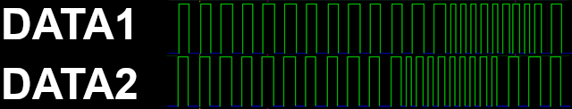

# Code Section

The following section details how I developed the code, the challenges and decisions made. Although not a dump of the entire code you should, once I've finished, be able to build your own version from the details within. 

To jump to a specific section click on the links below:
- [Notes of how to Identify which drive the Interface 1 is Accessing](#notes-of-how-to-identify-which-drive-the-interface-1-is-accessing)
- [Notes on sending data to the Interface 1](#notes-on-sending-data-to-the-interface-1)
- [Notes on the Microdrive Cartridge](#notes-on-the-microdrive-cartridge)
- [Notes on Cartridge Formatting](#notes-on-cartridge-formatting)
- [Notes on the Cartridge Tape Format](notes-on-cartridge-tape-format)
- [Notes on using the 2nd CORE](#notes-on-using-the-2nd-core)
- [Notes on Memory Usage](#notes-on-memory-usage)
- [Notes on Driving the OLED Screen](#notes-on-driving-the-oled-screen)
- [Notes on use of FATFS SPI Library](#notes-on-use-of-fatfs_spi-library)

## Notes of how to Identify which Drive the Interface 1 is Accessing

The Interface 1 uses a eight 1ms clock pulse (sent on the CLK line) combined with a COMMs signal to identify which Microdrive is being requested. This COMMs signal is shifted as it passes down the chain through each Microdrive's ULA, whereas the CLK signal passes straight through from one edge connector to the other. The Microdrive is designed to turn on when it sees the COMMs signal high on the last CLK pulse, with this pulse defined as the transition from high to low.

The following image shows the CLK & COMM signal for a `CAT 1` command. 


You can clearly see the COMMs signal goes high on the last CLK pulse. The next image shows the same for `CAT 2` and now you can see the COMMs signal goes high on the 2nd to last CLK pulse.


This is repeated all the way up to `CAT 8` where the COMMs signal is high as soon as the CLK pulses start.

In order for the Pico to determine which drive to start it simply monitors the CLK line attached to GPIO pin 2. When this goes low it starts a simple counter, decreasing from 8 to 1 on each CLK pulse. On each CLK pulse the PICO checks whether COMMs (on GPIO 4) is high and if it is high then the drive to use is the counter. If COMMs never goes high this is interpreted as a STOP signal and the drive is stopped. On first boot some Spectrums (I think this is just the 128k model) have the CLK signal set to low (it should be high until the drive is accessed) and this can confuse the counter. To prevent this a timeout can be used to reset the counter every few ms. This isn't full proof though so I do need to come up with a more elegant solution. Once the drive is accessed the machine will revert to normal operation with CLK high until needed.

Some example code which simply prints the drive selected:
````
#define MASK_CLK        0b000100
#define MASK_CIN        0b010000 // this is COMMs in, there is also a COMMs out which passes the COMMs signal to the next drive
//
uint32_t c; // used to get all the gpio states
bool pulse=true; // pulse is used to ensure count is only on the CLK transition from high to low
uint8_t driveSelected=0; // start with no drive selected
uint8_t driveCount=8; // start counter at 8
do {
    c=gpio_get_all(); // get all gpio ping status into 32bit unsigned integer c
    if((c&MASK_CLK)==0&&pulse==true) { // CLK low and pulse is true
        if(c&MASK_CIN) driveSelected=driveCount; // if COMMs also high then drive = count number
        pulse=false; // wait for next CLK high/low transition
        driveCount--;
    }
    else if((c&MASK_CLK)&&pulse==false) { // CLK high and pulse is false
        pulse=true; // reset the pulse toggle
    }
    // can put a delay here as no real need to sample all the time. The pulses are 1ms wide so every 100us should be enough
} while(driveCount>0); // exit when the drive counter is 0
if(driveSelected>0) printf("Drive Selected=%d\n",driveSelected);
else printf("No Drive Selected\n");
````

## Notes on sending data to the Interface 1

Once the drive select is complete (after the 8th CLK pulse) the Interface 1 is expecting data to be sent around 40-70ms after the CLK signal goes high. If nothing is received the `Microdrive not present, 0:1` message will be shown on the Spectrum. This small pause is to allow the real drive motor to the spin up and is the perfect opportunity to get data into a buffer ready to be sent to the Interface 1. 

As discussed in [Notes on Memory Usage](#notes-on-memory-usage) I use a read ahead buffer so during this initial 40ms the PICO grabs the first 12 sectors ready to stream to the Interface 1.

The playback always starts with a read with data being expected from the ZX PicoMD to the IF1. During a `SAVE`, `ERASE` or `MOVE` this will only change to a write phase when the IF1 has determined it is at the correct or a blank sector. The only time this differs is during a `FORMAT` which will start after the first sector is read in.

## Notes on the Microdrive Cartridge 

A Microdrive Cartridge can contain up to 254 sectors of data, with each sector made up of 512bytes of data. As such the maximum storage capacity is 512*254=130048bytes or 127kB. When formatting a drive using a real Spectrum sector 254 is never used making the real maximum size 129536bytes or 126.5kB (CAT shows as 126). Most real cartridges never get anywhere close to this, although some techniques used by add-ons such as the Multiface 128 and other software based utilities tweaked the format routine to eek out an extra sector or two. This tweaking was mostly about reducing the gaps between sectors to "fit" more on the tape. The cartridge tape was also prone to stretching over time and could actually format higher due to this after being used for a while. It is worth adding that Microdrives were notoriously unreliable which is probably one of the main reasons why the format was not successful long term.

A standard sector comprises of a header block and a data block. The header block contains the sector number and the name of the cartridge (max 10 chars). The data block contains the name of the file and all of the data. Other than during a `FORMAT` only the data block is written to during a `SAVE` or `ERASE` operation. The header block is just used to tell the IF1 which sector is being accessed.

The header block is 15bytes long and the data block 528bytes, giving 543bytes per sector. The following shows how each sector is made up:

Header:
````
Byte    Length      Description
0       1           bit 1 set to indicate header block
1       1           Sector Number (0xfe to 0x01)
2       2           Not Used
4       10          Microdrive Cartridge Name
14      1           Header Checksum of previous 14bytes
````

Data:
````
Byte    Length      Description
0       1           Data Flag:  bit 0 reset to indicate data block
                                bit 1 set for EOF block
                                bit 2 reset to indicate a PRINT file
                                bit 3-7 not used
1       1           Data Block Sequence Number (file broken into 512byte segments), starts at 0
2       2           Data Block Length, <=512bytes (LSB)
4       10          Filename
14      1           Data Checksum of previous 14bytes
15      512         Data Block
527     1           Data Block Checksum of previous 512bytes
````                  

An MDR image used by ZX PicoMD and many emulators is basically just 254 of these 543byte blocks put together with a final single additional byte which denotes whether the cartridge is write protected or not. There are more advanced format such as MDX which also record the data in the gaps which better represents the actual cartridge tape contents. I may adopt this format one day but for now MDR is fine.

On a real cartridge tape the sectors are placed in descending order, 254 to 1 (no sector 255 or 0) with small gaps between the header and data block and also between each sector. The header to data gap is ~3.75ms and the gap between two sectors is ~7ms. As noted above manipulating these gaps is one way to get more data onto the tape. On the tape the header and data blocks also have a preamble of 12bytes which tells the IF1 when the actual data is starting, this is made up of ten `0x00` bytes and two `0xff` bytes. When playing back from the ZX PicoMD these additional bytes need to be added before the real data, although as they are always the same there is no need to add to the image file stored on the SD Card. 

## Notes on Cartridge Formatting

As noted above `FORMAT` is the only time when the sector headers are written to the cartridge and as such the ZX PicoMD needs to be aware that a format is happening. During a format the IF1 will actually write more than the 528bytes expected during a write operation, 99bytes if using the standard ROM routines. These additional bytes are used by the ZX PicoMD to identify that a format is happening. 

During a format the IF1 sends all 254 sectors in turn, writing the header with the sector number and cartridge name and a data block with `0xfc` in all bytes. The IF1 then verifies all the data blocks checking the bytes are always `0xfc` and marking any bad sectors for a final write phase. This final phase enables all the good sectors by clearing the data block only, basically writing `0x00` to all bytes. A bad sector is noted by an EOF flag (`0x02`) with a data length of 0, the data block is also not reset to `0x00` and remains as `0xfc`.

In order for the IF1 to determine if a sector is good it is important that these additional 99bytes are presented back during the verification phase. The 99 extra bytes are always the same (`0xfc`) so there is no need to store them in the image file. When using a MF128 these extra 99bytes are not sent, however a single `0x80` byte is, which also needs to be presented back.

## Notes on the Cartridge Tape Format

All data is stored on a Microdrive cartridge tape using a "stereo" two track system with alternate bytes being stored on each track. These tracks are sent or received independently on the `DATA1` and `DATA2` lines. The tracks are staggered by 4bits with the `DATA2` track starting before the `DATA1` one. Recording in "stereo" means more data can be fitted on a single tape.

To send data to the IF1 the first two bytes are loaded into `DATA2` and `DATA1` respectively and then each byte is send one bit at a time. As noted above `DATA1` starts 4bits behind `DATA2`. Each bit is represented by a 12us pulse and the IF1 is looking for the data line to change during the 12us pulse to denote a `1` bit and for it to stay the same to denote a `0` bit. After each bit both data lines are flipped and the check starts again. Examining the data lines shows a series of wide 12us pulses (denoting 0s) and some tighter 6us pulses (denoting 1s).



## Notes on using the 2nd CORE

As all the main IO such as SD Card access, OLED and menu system are on core 1 and all the timing critical Microdrive elements are on core 2 there is a need to send commands between the two cores. As such my code makes use of the Pico inter-core FIFOs to communicate, sending commands to do things like telling the 1st core to get more data from the SD Card or to close an image file. The FIFO uses a 32bit integer `uint32_t` to communicate and I simply mask this into 4 individual bytes, a command a 3 "message" bytes.

````
#define CMD_MASK_CMD   0b11111111000000000000000000000000
#define CMD_MASK_VAL1  0b00000000000000000000000011111111
#define CMD_MASK_VAL2  0b00000000000000001111111100000000
#define CMD_MASK_VAL3  0b00000000111111110000000000000000
````

To launch the 2nd core from the 1st core I use the standard launch command and a very simple handshake:

```
multicore_launch_core1(core1main); // launch 2nd core to run the MicroDrive emulation
multicore_fifo_push_blocking(CMD_MASK_CMD); // push command to 2nd Core, simple handshake
while((multicore_fifo_pop_blocking()&CMD_MASK_CMD)!=CMD_MASK_CMD); // wait for response
```

On the 2nd core 

```
void __no_inline_not_in_flash_func(core1main)() {
    // sync cores
    while((multicore_fifo_pop_blocking()&CMD_MASK_CMD)!=CMD_MASK_CMD); // wait for message form 1st core
    multicore_fifo_push_blocking(CMD_MASK_CMD); // send a response
````

Using `__no_inline_not_in_flash_func` for the 2nd core means this code is always run from memory and not from flash. In theory this means timings are always the same and there is no delay in launching.

During normal operation the 1st core waits for a command from the 2nd

````
while(true) { // infinite loop
    rx=multicore_fifo_pop_blocking(); // wait for command from core 2
    cmd=(rx&CMD_MASK_CMD)>>24; // what is the command
    val3=(rx&CMD_MASK_VAL3)>>16; // message 1
    val2=(rx&CMD_MASK_VAL2)>>8; // message 2
    val1=(rx&CMD_MASK_VAL1); // message 3
````

When the menu is active (on core 1), I purposely close down the 2nd core to prevent any issues. This is because I use a shared memory area to copy data between the two cores and this coupled with some dynamic memory allocation resulted some memory corruption, in particular when using the memory heavy Z80 conversion routines. It was cleaner to shutdown the 2nd core and reset the shared memory again after the menu was exited and I knew the memory was only being used for data transfer.

````
switch (cmd) {
// Menu
    case 'M':
        multicore_reset_core1(); // reset core1 ready for re-launch 
````

## Notes on Memory Usage

The Raspberry Pico only has 256kB of memory which is actually a lot for a microcontroller. However when adding things like Z80 conversion of 128kB snapshots it quickly gets used up as you need to store the uncompressed 128kB Spectrum memory and also have room for the Microdrive cartridge to write to. As such I make use of the SD Card for memory buffers, a bit like to good old disk cache. This is slow but still good enough to complete the tasks in seconds.

For the ZX PicoMD I use a small shared memory area, defined globally using `uint8_t mem_buffer[MEMSIZE];` for transferring data between the cores. I also use dynamic memory allocation within the menu system for some the conversion utilities and file sorts. An example set-up from the Z80 conversion routine:

````
if ((main48k = (uint8_t*)malloc(49152 * sizeof(uint8_t))) == NULL) { // cannot create space for copy of main memory
    f_close(&fpIn);
    f_close(&fpOut);    
    return false;
}
````

In order to share memory between two cores you have to be very careful with contention, as in both cores accessing the same memory at the same time. In order to prevent this core 2 and core 1 use different parts of the shared memory unless a specific copy is being made at which point the cores wait for this copy operation to complete before moving on. This is all controlled by the inter-core FIFO.

A quick example, there are 3 key areas of the shared memory.

1. SD Card Read Buffer
2. SD Card Write Buffer
3. Microdrive Buffer

When a read is requested from Core 1 (as it needs more data) whatever is in 1 gets copied to 3 and control handed back to core 2. Once control is handed back core 1 grabs the next 12 sectors from the SD Card read for the next read request. As the copy takes micro seconds to complete there is easily enough time before the Interface 1 needs more data.

During a write the Microdrive will overwrite the Microdrive buffer with up to 12 sectors and once the 12th sector is passed core 2 will send a write command to core 1. This will simply tell core 1 to copy data from the Microdrive buffer to the SD Card Write buffer ready for the next SD card access. As the Microdrive now needs more data (it finished all 12 sectors0 it requests a read to get the next 12 sectors loaded and this trigger the SD Card write.

The following two pieces of code handle this read/write operation:

````
case 'R': // read operation requested from core 2
    for(i=0;i<MDR_SECTOR_SIZE*SECTOR_READAHEAD;i++) { // 12*543 = 6516bytes
        sectorBuffer_Read[i]=sectorBuffer_In[i]; // copy 12 sectors to Microdrive buffer
    }                
    multicore_fifo_push_blocking('X'<<24); // all done message               
    if(writeSector) {                                        
        readFilepos=f_tell(&fpRW); // move to correct place in file
        writeBack(sectorBuffer_Out,&fpRW); // write 12 sectors to file
        writeSector=false; // no more writes
    } 
    readAhead(sectorBuffer_In,&currentSector[driveNumber],&fpRW); // read next 12 sectors
break;
//     
case 'W': // write operation requested from core 2
    for(i=0;i<MDR_SECTOR_SIZE*SECTOR_READAHEAD;i++) { // 12*543 = 6516bytes
        sectorBuffer_Out[i]=sectorBuffer_Read[i]; // copy 12 sectors from Microdrive buffer to write buffer
    }
    multicore_fifo_push_blocking('X'<<24); // all done message         
    writeSector=true; // set to true so on next read it also writes
break;
````

## Notes on driving the OLED screen

To drive the SSD1306 OLED screen via the I2C interface I modified some Python based code by [makerportal](https://github.com/makerportal/rpi-pico-ssd1306). I re-used their initialisation, send command and show code (converting them to C from Python) but developed my own screen writing routines.

In the horizontal orientation of 128x64 the SSD1306 OLED screen is made up of 8 pages and 128 columns with each column made up of 8bits, so basically 8 rows of 128 single byte vertical segments. This requires a bit of pixel manipulation especially to show an entire image. For this I created a simple routine to show a double height ZX Spectrum font and also a routine which can take a GIMP RAW image file (128x64=8192 pixels or 1024bytes), rotating each 8bytes so they match the way the screen wants it and then compressing to save space, very useful for the menu system. I created a little [utility](rotbin.c) to create these compressed screens ready for the OLED, all that is then needed is to decompress these straight into 1024kB buffer, no rotation or change required. The following code takes a pre-rotated [ZX Spectrum font](zxfont_r.h), doubles the height and then puts it in the correct place on the screen (column & row):

````
// ---------------------------------------------------------------------------
// doubleChr - plot a double height character into a buffer
// input:
//   buff - buffer to plot char into
//   chr - character to plot
//   col - which column (0-15)
//   row - which row (0-3)
//   invert - true to invert char
// ---------------------------------------------------------------------------
void doubleChr(uint8_t *buff,uint8_t chr,uint8_t col,uint8_t row,bool invert) {
    uint16_t conv,fontAdder;
    uint16_t pos=(row*128)+(col*8);
    uint i,j;
    fontAdder=(chr-32)*8;
    for(j=0;j<8;j++) {
        for(i=0,conv=0;i<8;i++) conv|=((zxfont_r[fontAdder+j]&(1<<i))|((zxfont_r[fontAdder+j]&(1<<i))<<1))<<i;
        if(invert) conv^=0xffff;
        buff[j+pos]=(uint8_t)conv;
        buff[j+128+pos]=(uint8_t)(conv>>8);
    }
}
````

Using the screen is very simple, requiring a 1024bytes buffer, sending commands to set the column and page address and then writing the entire buffer to the screens small inbuilt buffer via `i2c_write_blocking`. The makerportal article covers this in a lot of detail.

All this requires `#include "hardware/i2c.h"` in the main c file and associated `target_link_libraries` in the `CMakeLists.txt` file.

Writing to the screen is too slow for it to be updated in real-time while the Microdrive is being accessed. In addition, as OLEDs suffer burn in I decided to only use it for menu activity and a basic a splash screen on boot. For all other times it is off and the side LEDs are used to show activity.

## Notes on use of FATFS_SPI library

As part of using this library you need to customise the `ffconf.h` file. The version I use has:

````
#define FFCONF_DEF	80196
#define FF_FS_READONLY	0
#define FF_FS_MINIMIZE	1 // removes un-needed operations such as mkdir in order to reduce memory footprint
#define FF_USE_STRFUNC	0
#define FF_USE_FIND		0
#define FF_USE_MKFS		0
#define FF_USE_FASTSEEK	1 // fast seek speeds up some operations which is useful due to the limited time available from an IF1 request and when data is needed to be sent
#define FF_USE_EXPAND	0
#define FF_USE_CHMOD	0
#define FF_USE_LABEL	0
#define FF_USE_FORWARD	0
#define FF_CODE_PAGE	437
#define FF_USE_LFN		3
#define FF_MAX_LFN		255
#define FF_LFN_UNICODE	2
#define FF_LFN_BUF		255
#define FF_SFN_BUF		12
#define FF_STRF_ENCODE	3
#define FF_FS_RPATH		0
#define FF_VOLUMES		1 // only 1 SD Card connected
#define FF_STR_VOLUME_ID	0
#define FF_VOLUME_STRS		"RAM","NAND","CF","SD","SD2","USB","USB2","USB3"
#define FF_MULTI_PARTITION	0
#define FF_MIN_SS		512
#define FF_MAX_SS		512
#define FF_LBA64		1
#define FF_MIN_GPT		0x10000000
#define FF_USE_TRIM		0
#define FF_FS_TINY		0 // I did play around with Tiny, to reduce memory footprint, but as only 1 file is ever open at one time it didn't make any difference
#define FF_FS_EXFAT		1 // yes please, FAT32 isn't great with larger SD Cards and Windows
#define FF_FS_NORTC		1
#define FF_NORTC_MON	1
#define FF_NORTC_MDAY	1
#define FF_NORTC_YEAR	2020
#define FF_FS_NOFSINFO	0
#define FF_FS_LOCK		16
#define FF_FS_REENTRANT	0
#define FF_FS_TIMEOUT	1000
#define FF_SYNC_t		HANDLE
````

As you can see I use fast seek to speed up the seek operations. It is not a massive improvement but when time is at a premium every milli-second counts. To use fast seek you need to allocate a small buffer to the routine based on the cluster size of the file system. My basic maths showed this needed to be around 70 as the smallest FAT32 cluster size is 4096bytes (256MB–8GB) so 34 clusters for a MDR file tops (MDR size is 137923bytes, 137923/4096=33.67), the equation is then (34+1)*2=70. This is based on nobody using <256MB SD Card and when using >8GB the cluster size only gets larger which decreases the buffer size. exFAT cluster sizes are larger than FAT32, smallest being 4096bytes for <256MB, 32kB for <32GB and 128kB for >32GB.

The code used to set-up fast seek is as follows:

````
FIL fpRW;
DWORD clmt[70]; // cluster link map table buffer for fast seek
//
f_open(&fpRW,cartName,FA_READ|FA_WRITE);
fpRW.cltbl=clmt; // Enable fast seek mode (cltbl != NULL)
clmt[0]=SZ_TBL; // Set table size                     
f_lseek(&fpRW,CREATE_LINKMAP);
````

I also changed the `spi.h` in order to flash the correct LED when accessing the SD Card, changing it to pin 13 from 25.

Finally a `hw_config.c` file needs to be created (in the root folder) to specify the hardware configuration required. The following is an extract of the important parts:

````
#include <string.h>
#include "my_debug.h"
#include "hw_config.h"
#include "ff.h" /* Obtains integer types */
#include "diskio.h" /* Declarations of disk functions */

void spi0_dma_isr();

// Hardware Configuration of SPI "objects"
static spi_t spis[] = {  // One for each SPI.
    {
        .hw_inst = spi0,  // SPI component
        .miso_gpio = 16, // GPIO number (not pin number)
        .mosi_gpio = 19,
        .sck_gpio = 18,
        .set_drive_strength = true,
        .mosi_gpio_drive_strength = GPIO_DRIVE_STRENGTH_2MA,
        .sck_gpio_drive_strength = GPIO_DRIVE_STRENGTH_2MA,
        .baud_rate = 12500 * 1000,  // A safe value, some cards can go faster but have to cater for slower cards as well. Also don't need mega speeds
        .dma_isr = spi0_dma_isr
    }
};

// Hardware Configuration of the SD Card "objects"
static sd_card_t sd_cards[] = {  // One for each SD card
    {
        .pcName = "0:",           // Name used to mount device
        .spi = &spis[0],          // Pointer to the SPI driving this card
        .ss_gpio = 17,            // GPIO pin 17 for the SPI CS connection
        .set_drive_strength = true,
        .ss_gpio_drive_strength = GPIO_DRIVE_STRENGTH_2MA,
        .use_card_detect = true, // The Micro SD Card reader I use has this feature, so this is turned on
        .card_detect_gpio = 22,   // Card detect GPIO
        .card_detected_true = 1, // What the GPIO read returns when a card is present. Use -1 if there is no card detect
        .m_Status = STA_NOINIT
    }
};

void spi0_dma_isr() { spi_irq_handler(&spis[0]); }
size_t sd_get_num() { return count_of(sd_cards); }
sd_card_t *sd_get_by_num(size_t num) {
    if (num <= sd_get_num()) {
        return &sd_cards[num];
    } else {
        return NULL;
    }
}
size_t spi_get_num() { return count_of(spis); }
spi_t *spi_get_by_num(size_t num) {
    if (num <= sd_get_num()) {
        return &spis[num];
    } else {
        return NULL;
    }
}
````

To use this file you need to add it to the Pico `CMakeLists.txt` file within the `add_executable` add `hw_config.c`. If you do put it in a directory make sure you add the path.
