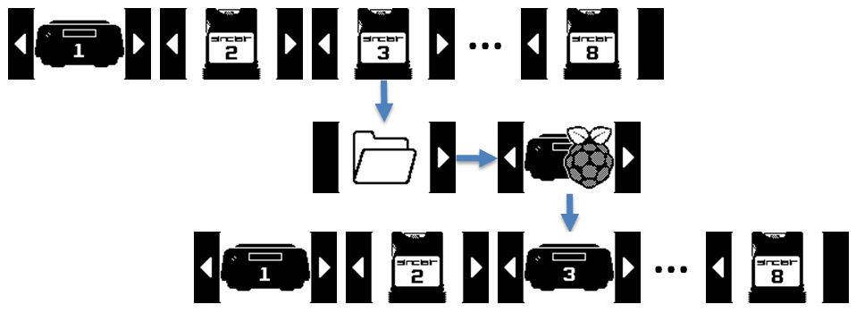
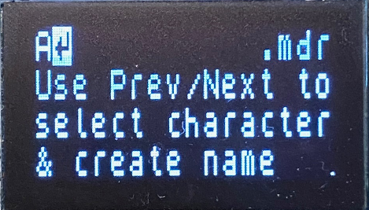
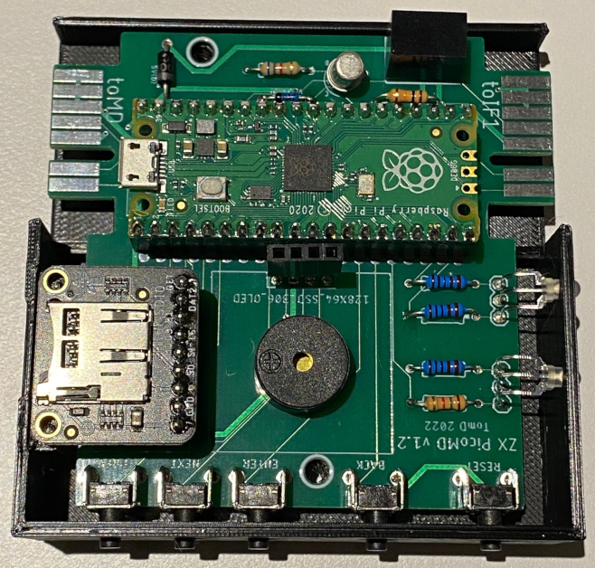

# ZXPicoMD

Raspberry Pico ZX Spectrum Microdrive Hardware Emulator (https://en.wikipedia.org/wiki/ZX_Microdrive)

Hardware emulation of 8 microdrives for the ZX Spectrum only (no plans to adapt for the QL, if you want a Microdrive emulator for the QL see http://oqtadrive.org/). Main features are:
- Supports all 8 Microdrives from one device
- Supports downstream real h/w Microdrives (if you have a v1.1 PCB you need a [small hardware mod](#v11-pcb-hardware-mod-for-real-hw-support))
> **Warning**
> If using with a real h/w Microdrive you must use the correct Connection Block between the ZX PicoMD and the Microdrive, not the ribbon cable connector you use to connect to the IF1. A connection block passes the pins straight through, whereas the cable will flip the pins top to bottom. This results in 9v being passed to the wrong pin which could damage your Microdrive. I've created a design so you can make your own (https://www.thingiverse.com/thing:5908920), or you can find them on eBay now and again.
- OLED screen with buttons to navigate the menu - includes load, save & format cartridges as well as other options (see [menu section](#the-gui)). No additional toolkits, software or connections needed as all managed from the menu
- FAT32 & exFAT supported Micro SD cards up to a theoretical 256TB (I've tested 2GB, 4GB and a lowly 64GB which can easily fit every Spectrum game and program ever made multiple times)
- Reset button just in case (also makes it easier to flash the Pico)
- Buzzer in case you like a buzzing sound to "simulate" the drive motor
- Includes a version of my Z80onMDR tool (https://github.com/TomDDG/Z80onMDR_lite) to make it easy to load Z80 & SNA snapshots on the fly. Very useful as not many actual Microdrives cartridges released commercially.
- Can copy the contents of a TAP to a blank Virtual Microdrive Cartridge (see [TAP copy section](#tap-copy) for details)
- Fully powered from the Spectrum & boots instantly
- Unfortunately you do still need an IF1 (https://en.wikipedia.org/wiki/ZX_Interface_1)

Load up the SD card with all your favourite games and programs and enjoy hours of nostalgia with the blistering 15kB/sec transfer rate. Yes you can now load a game in a few seconds!

## How to Get One
- I designed ZX PicoMD to be very easy to build so anybody should be able to get the parts and put one together. I picked parts which are easy to get even with the current chip shortage, basing the whole build around the Raspberry Pico. It does require some soldering but this is all through hole not surface mount so a lot easier to do. I've included full details on how to [build one](#building-with-case) including [bill of materials](#bom) with links to the parts.
- I do occasional build some complete units to sell on eBay https://www.ebay.co.uk/usr/tom_dd

## Installation

If you are building your own start at step 1, for pre-built jump to step 5
1. Download the correct UF2 from the UF2 folder (_w for Pico W)
2. Flash the Pico with the UF2 (see 3.2 https://datasheets.raspberrypi.com/pico/getting-started-with-pico.pdf)
3. Build the circuit (see below) - best to use the PCB (https://www.pcbway.com/project/shareproject/Raspberry_Pi_Pico_ZX_Spectrum_Microdrive_Hardware_Emulator_37750e81.html)
4. Print a nice case to house the device (optional)
5. Format a blank Micro SD Card (recommend exFAT) and insert into the SD Card reader
6. Connect to the IF1 using an appropriate cable
7. Turn on the Spectrum and you should see the splash screen if all working

## Version History
- v1.4 (latest release) - Added buzzer loudness option (off/low/medium/high), previously only off and low were available
- v1.3 - Added [Quick Swap](#quick-swap) functionality to Drive 1 & added wrap around to the file explorer
- v1.2 - improved write code (timings, input delays, SD Card buffers) to remove chance of bad sectors plus some bug fixes
- v1.1 - added [TAP copy](#tap-copy), version number on splash screen & bug fixes
- v1.0beta2c  - fixed real hardware not working with the ZXPicoMD. *Note v1.1 PCB needs a small hardware mod to work, see mod section below
- v1.0beta1 - added support for real hardware Microdrives downstream of the ZXPicoMD *Note doesn't work with real h/w Microdrives, tested working with vDrive emulated drives only.
- v0.94 - added a simple filename generator to the cartridge save option
- v0.93 - fixed MF128 format
- v0.92 - added sound on/off menu option to turn off the buzzer, saves config to the SD Card
- v0.91 - first public release, all basic functions in place

## First Usage
First you need to format your micro SD card using a PC/MAC, I recommend exFAT but FAT32 is also fine. Using the same PC/MAC you can also create a folder for your files and copy games or programs into these directories. You don't need any files for the device to work so this is just if you want to use it to load games etc... Insert the micro SD Card into the device while it is powered off and then turn on the Spectrum with the device connected. If all ok you will see a Splash Screen followed by a screen saying it is setting up the SD Card. Just wait for this to complete and once the screen goes blank and the blue LED comes on you are good to go.

## Usage
The device is very simple to use, upon booting the Spectrum you will see a Splash Screen which will disappear after a couple of seconds. The screen will then stay blank (OLED is off to prevent burn-in) and the blue LED (or whatever colour you picked) will light up on the side to indicate the device is ready for input, either from the IF1 or by the user pressing a button. You can now use all the normal commands on the Spectrum to control the drive such as `RUN`, `LOAD *"m";1;"aaa"` or `FORMAT "m";5;"blank"`. 

When the blue LED is on so the unit is input ready you can enter the Menu to select new cartridges etc... for full list of menu items see the chart below. To enter the menu press the enter key which is 3rd from left. You should now see the Cartridge 1 icon. Pressing enter again takes you to the cartridge sub-menu, showing a folder icon. Pressing again and you will enter the file explorer where you can navigate the listings to pick a new cartridge or snapshot to convert.

The buttons are (from the left): Previous; Next; Enter; Back; Reset

Previous & Next are used to go left/right or up/down in the menu or file explorer. Enter is used to select an option or file (also to enter the menu in the first place). Back goes up one level in the menu or when using the file explorer moves up one directory. Reset reboots the Pico if all else fails (also useful when flashing the Pico). If you hold down the buttons it also behaves differently in certain scenarios, for example holding down Next in the file explorer goes down one page of file entries rather than just one file entry.

The LEDs show certain activity:
1. The top LED (furthest from the buttons) is Drive and Write for when the Microdrive is being accessed. Drive will come on when the simulated motor is on (if you installed a buzzer you will also hear it). Write will come on (replacing Drive) when the ZXPicoMD is receiving a WRITE signal.
2. The other LED is for SD Card access and Input ready. SD Card is simply to show when the SD card is being accessed (don't turn off). Input ready is to show when the drive is idling and therefore ready for a command or input.

## Development

Built from the ground up using the the Pico C SDK (https://raspberrypi.github.io/pico-sdk-doxygen/). Uses Pico multicore to separate the time critical emulation components (core 1) to the interrupt driven IO (core 0). For more details on how I built the code please see the [code section](./Code/README.md)

Big thanks to Alex from OqtaDrive fame (https://codeberg.org/xelalexv/oqtadrive) for help with understanding the Microdrive hardware & troubleshooting. 

Some additional references:
- Spectrum Microdrive Book - https://spectrumcomputing.co.uk/entry/2000365/Book/Spectrum_Microdrive_Book
- Microdrive & Interface 1 Manual - https://spectrumcomputing.co.uk/entry/2000442/Book/Microdrive_and_Interface_1_Manual
- Make the Most of your ZX Microdrive - https://spectrumcomputing.co.uk/entry/2000231/Book/Make_the_Most_of_Your_ZX_Microdrive
- Sinclair IF1, IF2 & Microdrive Service Manual - https://spectrumforeveryone.com/wp-content/uploads/2017/08/ZX-Interface-1-2-Microdrive-Service-Manual.pdf

Code makes extensive use of the excellent Pico SD Card Library by carlk3 (https://github.com/carlk3/no-OS-FatFS-SD-SPI-RPi-Pico). This gives full access to the also excellent small embedded systems FatFS (http://elm-chan.org/fsw/ff/00index_e.html).

### Design Decisions

Outside of basing this around the easily obtainable Raspberry Pico I also made the following design decisions:
- **Use of logic level converter** - The initial circuit design included a logic level converter to shift the 3V3 voltage of the PICO to 5V and vice versa. This worked fine stand alone but caused downstream real h/w to fail as it interfered with the data lines. Through experimenting I found that the Interface 1 actually accepts a voltage lower than 5V and 3V was fine to drive the logic. For the reverse I needed to protect the Pico from a 5V input (there has been some research showing the Pico may actually be 5V tolerant) and to do this I put a diode in series and pulled the GPIO of the Pico high using internal pull-up resistors rather than a separate circuit. In operation when the Interface 1 ULA pin goes low it pulls the GPIO of the Pico low as there is a path to ground which overrides the internal pull-up. If the Interface 1 is high the pin remains high as 5V will exist beyond the diode so nothing to pull the GPIO low.
- **Write protect pin using a transistor circuit** - The write protect pin on a real Microdrive is a mechanical switch connected to the 9V line. As this is way too high a voltage for the Interface 1 ULA there is a simple voltage divider circuit before the ULA pin which takes the 9V down to around 4.5V. Due to this additional circuit you cannot feed the Pico 3V3 pin directly to the Interface 1 as it would be <2V by the time it reached the ULA (even via a level shifter it would only be around 2.5V). A simple transistor circuit connected to the 9V line solves this and provides around 6V to the Interface 1 which becomes 3V after the voltage divider. As I've shown with the removal of the level shifter this is enough for the input pin on the ULA.
- **Use of SD Card instead of Flash Storage** - During the design phase I wanted to make extensive use of the 2MB flash storage to store the 8 Microdrives and then only change them when inserting new cartridges. Although working fine when read only, using these for writing was just too slow as it isn't easy to only write part of the data to flash (it works in 4096byte sectors). It is also difficult to flash the storage in the middle of an operation as it requires the Pico to be "paused" in order to prevent crashes/conflicts due to the way it uses flash and volatile memory to store the executable code. I did try and run the entire code from memory but wasn't able to get it to work. Anyway I was always planning to use an SD Card for storage so this simply made me move to that earlier. As usual SD cards come with their own challenges but luckily these were easier to solve. 
- **SD Card Read/Write Operation is Too Slow** - A typical SD card via the SPI interface only reads/writes at around 750kB/s which means a single MDR takes about 200ms to load and that is only under optimal conditions. Any seek delays or similar will make this much more like 0.5-1second which is too slow. Once a command is received from the Interface 1 there is around 50-100ms available before the the data stream needs to start or you will get the Microdrive not present message. This requires the data to be loaded in smaller sections and I initially picked an 8 sector read/write buffer. A MDR has 254 sectors so this breaks the data into 32 sections which, even at its slowest this, is <30ms. This worked ok but I still noticed that some read/writes took too long causing the device to crash or give bad sector information to the Interface 1. I believe this was due to how the access buffers work with the SPI library but it is way too much of a black box for me to mess with. As part of the fixes for v1.2 I increased the buffer to 12 sectors giving plenty of time between each read/write operation while still being quick enough to feed the Interface 1.

## Connected to a ZX Spectrum

Following image shows everything connected. The ZXPicoMD is fully compatible with the Multiface 1 and 128 (shown in the photo).

## The GUI

### Main Menu
- Power Off - not really required just don't switch off in the middle of a write as it could corrupt the files on the SD card
- Factory Reset - this creates 8 blank cartridges on the SD card root
- Sound Volume - Off, Low, Medium & High. The buzzer was always intended to be quiet as I didn't want it to be annoying. Some users responded it was too quiet to even hear with the case shut (I can still hear it ok) so I added the higher volumes. I also found that not all buzzers are created equal so adding the different volume levels helped with that.
- Eject SD Card - as it says, this safely unmounts the SD card so you can take it away and load up with more games
- Restart Emulation - Just resets the 2nd core, back button does the same at this level of the menu
- Cart 1 to 8 - Enter sub-menu for that specific Microdrive

### Microdrive Sub-Menu
- File Selector - enter the file explorer to navigate the folders on the SD card to select a file to load
- Quick Swap (Drive 1 only) - turns on/off [Quick Swap](#quick-swap) functionality
- Switch to Real H/W - switches the drive number to a real H/W Microdrive. With this enabled the ZXPicoMD will emulate the shift register to activate the drive when called
- Cartridge Info - shows a basic CAT of the cartridge inserted
- Write Protect - toggles write protect on/off for the cartridge inserted
- Save Cartridge - creates a copy of the cartridge in the root directory of the SD card so all your work doesn't get lost if you load a new cartridge into the drive. See [Filename Selector](#using-the-filename-selector) section below.
- Insert Formatted - as it says load a blank formatted (to 127kB) cartridge into the drive

The file explorer will only show compatible files, those with extension MDR, TAP, Z80 & SNA and directories.

### Quick Swap

Firmware v1.3 added quick swap functionality to drive 1 allowing the user to quickly swap between 4 pre-loaded cartridges. This was only added to drive 1 as this drive number is often hardcoded into programs so being able to quickly flip between cartridges is an advantage.

To use Quick Swap on drive 1 you have to first turn it on. To do this go into the menu (enter button), select drive 1 and scroll one right of the folder icon. You should see an icon with a swap symbol. Click on this and you will get a message that it is setting up Quick Swap for Drive 1. This takes a few seconds as it is creating 4 new cartridges, copying the contents of the current drive 1 cartridge to A, and creating 3 blank cartridges B,C & D. Once done it goes back to idle (blue light) and is ready to use.

To quickly swap the cartridges just press the PREV or NEXT buttons and a selector will pop up showing cartridges 1A to 1D. Just pick the one you want, press enter and it will complete the swap. Simple as that.

If you want to put a new image into a certain quick swap cartridge just first select the one you want, say 1D, and then just use the normal menu options to load a Z80 or format it etc... If you turn off quick swap (using the same icon), the cartridge currently selected remains in drive 1 and the others are lost, so recommend you save them first if needed.

### TAP copy

Selecting a TAP file from the file explorer will copy the contents to a blank cartridge. It works with headerless files as well as normal and also removes the autorun from basic files so they can be edited. As headerless files have no file type or start address these are simply set as a code block starting at memory end minus length.

Note this is a simple file copy so if you are wanting to run a loader, usually for a game, off the cartridge you will need to adjust said loader to use Microdrive commands. Unfortunately this isn't always possible as a lot of games use machine code loaders but some are and the following details how to do this for the classic Manic Miner.

Once the copy has complete `CAT` the drive and you will see

Now Load the `(Info)` file:

 Load")

This will show details of the files copied from the TAP in `REM` statements. Write down the filenames `mm1` (the loading screen) & `MM2` (the main code) for later.

 Load 2")

Now load the main basic loader `ManicMiner`:

and `LIST`

Now edit the loader with the correct Microdrive syntax `*"m";1;` and filenames you wrote down earlier:

Save this as `RUN` with autorun `LINE 1` added so you can use the shortcut on reboot:

The game will now load using `RUN`:

### Working with Real H/W Microdrives

> **Note**
> If using with a real h/w Microdrive you must use the correct Connection Block (shown below) between the ZX PicoMD and the Microdrive not the cable you use to connect to the IF1.
>

As of release v1 beta you can now put real h/w Microdrives downstream of the ZXPicoMD. Please note these only work downstream (ZXPicoMD closest to the Spectrum) as the ZXPicoMD needs to control the COMMs shift register in order to mix virtual/emulated drives and real h/w drives. Any drive combination can be used with the only restriction being a lower numbered drive will be activated first, example, if you pick drive 2 & 4 as real h/w drives the lower number, 2, will be the one next to the ZXPicoMD and 4 the one after.

The following diagram shows how to select drive 1 as real h/w.

and how to add drive 3 as real h/w.

With drive 1 & 3 set to real h/w, CAT 1 will access the first real drive connected to the ZXPicoMD. CAT 3 will access the second real drive, the one connected to the first real drive. All other drive selections will access a virtual/emulated drive.

To flip back to virtual/emulated drive just select the drive in the menu.

## Using the Filename Selector

When saving a cartridge to the sd card you can specify a filename by using a simple character selector as show below:

Use the previous and next buttons to pick the character you want and press enter to select the character, note unless you are on the last character the enter is used to select the character not to complete the name. To complete the name before the last character there is a complete name option towards the beginning of the selector (see list below). To delete an entered character you use a remove character option at the beginning of the selector. The selector only allows you to enter alphanumeric characters i.e. no specials and maximum length is 12. The order of the characters is:

- Remove character (delete)
- Complete name (looks like enter symbol on your keyboard)
- Space
- 0-9
- A-Z
- a-z

You can't pick anything before 0 (zero) for the first character. If you press back it will exit the selector and if you either pick the complete name option or enter 12 characters it will ask if you want to save or not. Pressing enter again saves the cartridge to the root of the SD Card.

## v1.2 Circuit (the one without BOB)

The following circuit does not include the level shifter which is no longer required due to the IF1 accepting the lower voltage output of the Pico ~3V. For the old circuit please click [here](./Images/PicoDriveZX_Circuit_v3a.png)

## v1.1 PCB Hardware Mod for Real H/W Support

Unfortunately during testing it became apparent that the BOB level shifter interferes with the data output of the real Microdrive and lacks the OE pin which would put it into high impedance mode. During initial testing everything worked fine with a vDrive, in place of real h/w, as its signal strength is much stronger and therefore wasn't affected by the BOB.

Luckily this is extremely simple to fix and doesn't need any complex re-routing or code changes, in fact all you need to do to get the v1.1 PCB working with real hardware is to replace the BOB-12009 level shifter with 3 diodes as shown in the image below (note the cathode line at the top HV side). I've tested this with standard 1N4148 and BAT43 Schottky diodes. The BAT diodes have a better voltage drop, measuring I show 3.0V for the 1N4148 and 3.2V with the BAT. Recommend to use BATs although 1N4148 seem to work fine.

## BoM

- 1x Pico or Pico W with headers soldered
  - +2x 20pin header sockets
- 1x Traco Power TSR 1-2450 (9v to 5v, 1 Amp) - https://www.tracopower.com/int/model/tsr-1-2450 (you can use alternatives these are just the best and very efficient, if you do use alternatives remember you may need additional circuitry)
- 3x BAT42/43 diodes for D1(D), D2(D) & CO(D). If using a v1.1 PCB connect these LV1-HV1, LV2-HV2 & LV3-HV3, line at HV side. BAT42/43 are a better option to 1N4148 due to the reduced voltage drop, however 1N4148 should also be ok. The v1.1 PCB can also use a SparkFun Logic Level Converter ([BOB-12009](https://www.sparkfun.com/products/12009)) if not paring with real h/w Microdrives, however recommend you use diodes.
- 1x SSD1306 OLED 0.96" (you can get larger ones just make sure they are SSD1306). Be very careful of the GND & VCC placement as they are sometimes reversed. If using the v1.3 PCB make sure the jumpers are in the correct place for the GND/VCC orientation.
  - +1x 4pin header socket if using the PCB. If also using the 3D printed case get header sockets with extra long legs so the OLED can be mounted higher
- 1x Adafruit Micro SD SPI or SDIO Card Breakout Board - https://www.adafruit.com/product/4682
  - +1x 9pin header socket if using the PCB
- 5x 6×6mm Right Angle Micro Push Buttons for mounting on the PCB (you can use any push button these are just the ones that I use)
- 2x Bi-Colour LEDs, common cathode (centre negative). Pick whatever colours you want and change the resistors to match, my rule of thumb is forward voltage/2 in kOhms so if forward voltage is 2V use a 1kOhm resistor. The LEDs are (D)rive/(W)rite and (S)D Card Access/(I)nput Ready.
- 5x 1n4148 diodes [WR.PR(D), ERASE(D), COMMS(D), RW(D), CLK(D)]. These could also be replaced with BAT42/43 diodes but only WR.PR is output.
- 1x 1n4001 diode for the 5v in, this is to allow USB to be connected and the Spectrum at the same time (any of the 400x series should work, I use 4004 as it was the one I had in stock) [5V(D)]
- 1x 10kOhm Resistor for write protect circuit [WPC(R)]
- 1x 6.8kOhm Resistor for write protect circuit [WPB(R)]
- 1x 2N2222 Transistor for write protect circuit
- 1x 1407 Type Passive Piezo Buzzer (if you use the PCB). 
- 1x 3D Printed Case - STLs for the 3D Printed Case can be download from Printables (https://www.printables.com/model/297015-case-for-zx-picomd-sinclair-zx-spectrum-microdrive) or Thingiverse (https://www.thingiverse.com/thing:5569842)
  - 1x #4 (3mm) 1/4" (6.5mm) screw to secure the PCB to the case and 2x #4 (3mm) 1/2" (13mm) screws to secure the top of the case to the bottom
  - If using v1.3 of the PCB, 1x 2x2 pin header and 2 jumpers

## PCB

I have designed a PCB to house everything and you can purchase v1.2 on PCBWay (https://www.pcbway.com/project/shareproject/Raspberry_Pi_Pico_ZX_Spectrum_Microdrive_Hardware_Emulator_37750e81.html). I've also entered it into the 5th PCB Design Contest (https://www.pcbway.com/activity/5th-pcb-design-contest.html)

- v1.0 - original design for testing, lacks COMMS OUT & WRITE PROTECT circuit
- v1.1 - added simple transistor circuit to control Write Protect and also passes the COMMs down the chain for additional Microdrives. 
- v1.2 - removed bob-12009 level shifter and replaced with diodes, some refactoring. *Note this is simply a cosmetic change and v1.1 works fine with real h/w by simply replacing the bob with diodes as shown in the hardware mod section
- v1.3 - added a pin header so OLEDs with VCC and GND reversed can be used plus made it impossible to attach a cable to the Microdrive connector side ensure only the correct connector block can be used. Also a general tidy up of the routing plus added a ground plane on front and back removing the reliance on the Pico to do this.

Older v1.2 PCB for reference

## Case

The PCB was originally designed to fit in a real Microdrive case as it is based on my Oqtadrive PCB. As such the screw holes etc... line up perfectly, however, the addition of the buttons and OLED mean, although it will fit, you won't be able to use it without cutting the case. As such I designed a custom 3D case (https://www.thingiverse.com/thing:5569842) to match the Spectrum + models such as the 128k Toastrack.

### Importance of Adding Feet

I recommend adding some rubber feet to the case. If you can get hold of them the original feet are fine, however, I recommend the smaller [3M Black Bumpons (SJ5076)](https://uk.rs-online.com/web/p/anti-slip-pads/1206041) which lift the case to the correct height (by ~2.8mm). This height adjustment is a requirement if you plan to connect this to a real Microdrive using the connector block. Without the feet the edge connector will be at the wrong height and won't fit together very well. If you don't plan on using this with a real Microdrive the feet are not needed although I still recommend them for anti-slip.

## Building with Case

This guide is based on v1.2 of the PCB, however it also applies to v1.1 with the diodes placed where the BOB was. 

First solder in the diodes, resistors, buttons, buzzer, transistor & TSR 1-2450 as per the silk screen, being mindful of the orientation of the diodes. I recommend you use BAT42/43 Schottky diodes for Data 1 [D1(D)], Data 2 [D1(D)] & Comms Out [CO(D)] as these are small signal outputs which may benefit from the lower voltage drop.

Follow this with the header sockets for the Pico (20-pin) and Micro SD Card reader (9-pin). Ensure these are straight before fully soldering with the best way being to solder one leg check it is straight and then soldering the rest. For the Pico header I'd recommend plugging in the Pico first, use a bit of blue tack to hold in place, and then solder ensuring it all aligns. 

Now solder in the bi-colour LEDs. Mount these so the bulb is slightly above the top of header socket, this gives enough height to bend into place later.

After this you should have the following set-up (blue diodes are BATs, red are 1N4148s):

The OLED socket needs to be raised off the PCB in order for the screen to fit in the top of the case, these longer legs sockets are often referred to as stackable pin header sockets. The best way to get this at the correct height is to first mount the OLED into the top case, plug the header socket in, and then put the PCB on top (bottom up). Ensure the PCB is straight and then solder in place. It should now look like this:

You can now fit the Pico & Micro SD-Card socket and mount into the bottom part of the case by sliding in the front buttons first and then securing with a small screw. Be careful when bending the LED legs to fit the side holes and ensure the Micro SD card slot is flush to the side of the case as shown in the photo.

Pop the top of case on but remember the OLED screen pins need to fit in the raised socket. This can take a couple of goes. A final touch is to add a rainbow sticker to match the original case. I've created a PDF [sticker sheet](./Images/stripes.pdf) if you want to print your own 

## Testing the ZX PicoMD

Once built I run the device through a series of tests. The main one is a [test cartridge by Martin Smith](./TestCarts/Test%20MDR%20Emulation%20(1994)(Martin%20Smith).mdr), you can download this by clicking the link or from the TestCarts folder. This utility was initially designed to test emulators so works great for making sure everything is ok with the ZX PicoMD. There is also the [test routine that comes with the offical service manual](./TestCarts/MDIF1Test.mdr) which I've also put in the TestCards folder. 

Another test I run is making sure the write protect circuit is ok by toggling it on and trying to format a cartridge, this should fail with a write protect message, toggling it back off and it should work again.

In addition I've also uploaded two IF1 ROM version check cartridges, one based on a CRC check routine by Blaze and another which looks for the location of a HOOK routine in the shadow ROM written by Andy Pennell for Your Spectrum (Issue 20, page 13). These both determine the ROM version of the IF1 you are using which is useful for debugging as I've only been able to test ZX PicoMD with a v2 ROM.

## FAQ

- I'm getting a `Microdrive not present, 0:1` message
  - Microdrives & Interface 1s are getting old now so make sure the edge connectors are clean. Use some Isopropyl (Rubbing) alcohol to clean the PCB connector on the IF1 (left hand side). Also check the Microdrive connectors are fully plugged in.
  - There is a known issue with some Spectrums that on first boot the CLK signal is set low when it should be high. This confuses the ZXPicoMD as it keeps thinking there is an incoming CLK pulse, a simple retype of the command will fix it and it will then be ok till next cold boot.

- Nothing happens when I enter a Microdrive command such as `CAT 1`
  - First thing to do is check the Interface 1 is working ok. The service manual has some commands which you can use to check it:
    - After a reboot, type the following `PRINT p` and enter, you should get the response `Variable not found`
    - Then type `RUN` followed by enter and you should see `Program finished`. If you do it means that the paging mechanism is working, the ROM is functional, internal ICs & ULA are at least partially ok and connections to the Spectrum are good. If the message `OK` appears it means that the ZX interface 1 is not working or the connection is not good to the Spectrum.
    - If any of the above fail I recommend you clean the edge connectors of the Spectrum using Isopropyl (Rubbing) alcohol or a pencil rubber followed by alcohol. This will mean opening up your Spectrum to get good access to the PCB. If it still doesn't work after that, unfortunately either your Spectrum of Interface 1 has a fault. There are a few guides online which can help you diagnose any faults, good place to start is the Interface 1 service manual which I've linked above.
  - If you have a real h/w Microdrive you can use it to make sure everything is working. Even if you don't have a cartridge you can check the LED lights up and the motor starts up when you type `CAT 1`.
    - As with the other checks, if nothing happens clean the edge connectors thorougly before trying again.
    
- My TAP files are not showing in the file explorer
  - This can happen if the files are not named .TAP or .tap. If they are .Tap, .tAp or .taP it will not pick them up. I will fix this so all cases are accepted in a future release
  
- Why can't I convert TZX files only TAP & Z80/SNA
  - TZX would not be possible unless it uses the ROM loading routines which is basically a TAP. TZX has non standard, speed or beep loaders which would need to be loaded in via an emulator. Basically I would need to build a fully working Spectrum emulator on the PICO to be able to transfer them. This is why Z80s are easily the best option as they are an exact memory replica of when the game has loaded and are really easy to convert. Only downside is multi-load but those are also very hard to convert as you would need to hack the code to replace the level loader with a Microdrive one.

- Why is my SD Card slow to list the directory? I've tested this with ~1000 files in a single directory and it should take no longer than a second to show a directory listing. If you are finding access is slow, please try the following:
  - Don't put thousands of files in a single directory, try to limit it to <1000 per directory otherwise it will take a long time to find what you need as the OLED only shows 4 files per screen. Put the files in a-z directories as an example.
  - Copy everything off your SD Card onto a PC, reformat the SD Card and copy it all back on. This ensures the files are on the SD Card sequentially which speeds up access significantly. This also helps as I use a basic sort algorithm, if the files are already sorted this has less to do.
  - Try to use a modern Micro SD Card of at least C10 rating. As of writing the cheapest cards seem to be the 32GB ones which are most likely UHS Speed Class which will work fine and way more space than you need. I've configured the SD Card access speed to be 12.5Mbits/s which is ~1.5MBytes/s (more like half that in reality) so anything above that in theory should be fine. Image below shows the results from a quick speed test on a couple of cards, top one is a class 10 and the other is an older 2GB rated for 30MB/s. Both of these cards worked fine:
  

- Can I use ZIP files?
  - The ZX PicoMD does not currently work with ZIP files. The main reason for this is the need to compress files to save space is kind of redundant with the size of the cheapest modern SD Cards. A 16GB or 32GB Micro SD card can easily store the entire uncompressed Spectrum library multiple times, including having both Z80s, SNAs, MDRs & TAPs. Z80 files are also already compressed, although not as well as ZIPs would be. Some quick maths shows that if we used uncompressed MDRs, which are 137923Bytes in size, a 16GB SD Card can store over 100,000 microdrive cartridges! Z80 & TAPs are usually smaller than MDRs. As of writing this a 32GB SanDisk branded micro SD card is £6 on Amazon.
